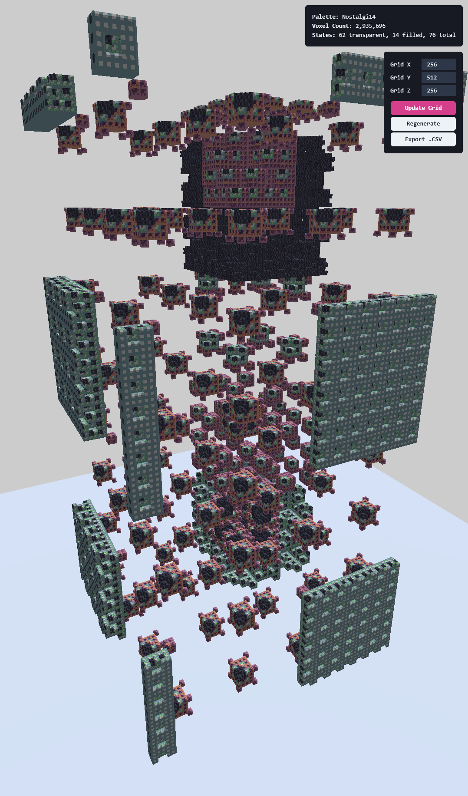
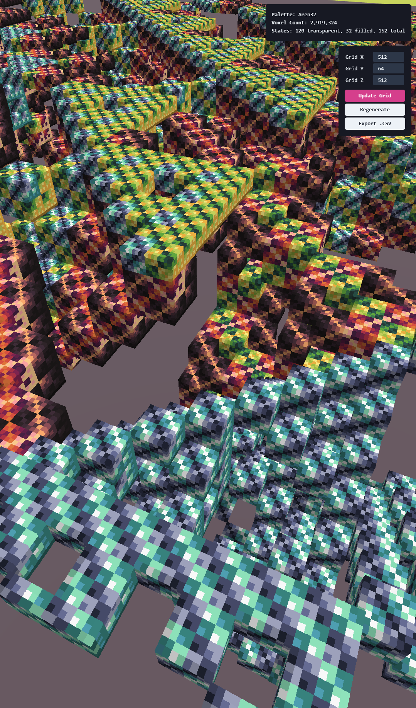

# 3D Bitfields

Generative voxel art created with bit-wise operations and modular arithmetic. Can render **millions** of voxels in real time!

<div align="center">

| | |
|---|---|
|  |  |

</div>

---

## Live demo

https://**dalessandroj**.github.io/**threejs-bitfields**

---

## Features

* **GPU ray-marched voxels** (WebGL 2 + Three.js RawShaderMaterial)  
* **Bitwise Boolean patterns** – 256 truth tables × spatial permutations  
* **Dynamic grid sizing** (independent X / Y / Z)  
* **One-click palette refresh & CSV export**  
* **Responsive React controls** 
* **Zero-config build** with Vite + GitHub Pages deploy

---

## Local development

```bash
git clone https://github.com/dalessandroj/threejs-bitfields
cd threejs-bitfields
npm install
npm run dev      # open http://localhost:5173
